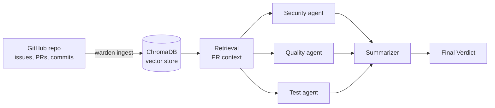

# pr-warden

[](https://github.com/Amowixcode/pr-warden/actions/workflows/ci.yml)

Context-aware PR review CLI built with LangGraph multi-agent orchestration and RAG. Indexes a
GitHub repo's history (issues, merged PRs, commits) into ChromaDB, then reviews pull requests
with three specialist OpenAI-backed agents — security, quality, and test coverage — running in
parallel and merged into one verdict. Available as a CLI (below) or as a hosted
[web app](#web-app).


## Architecture



See [`agents/README.md`](agents/README.md) for the full graph design and merge policy contract.

## Usage

```bash
warden ingest owner/repo               # index a repo (incremental if ingested before)
warden ingest owner/repo --full        # force a complete re-ingestion, ignoring ingest history
warden review owner/repo 123           # review PR #123 (incremental if reviewed before)
warden review owner/repo 123 --full    # force a complete review, ignoring prior review history
warden review owner/repo 123 --json    # same review as machine-readable JSON, for CI/tooling
warden review owner/repo 123 --verbose # also show each agent's own findings, not just the merged verdict
warden doctor                          # run setup/health checks (GitHub token, OpenAI key, ChromaDB)
```

## How a review works

1. `warden ingest` pulls issues, merged PRs, and commits from GitHub and embeds them into
   ChromaDB. It persists the last-ingested timestamp per repo (`./data/ingest_history.json` by
   default); a later `warden ingest` of the same repo only fetches items created or updated
   since that run — the existing dedup-on-insert check still applies regardless. Pass `--full`
   to force a complete re-fetch.
2. `warden review` fetches the target PR, retrieves related historical context, then runs three
   specialist agents in parallel, each backed by its own OpenAI call:
   - **Security** — hardcoded secrets/credentials, injection risks, unsafe deserialization,
     authentication/authorization gaps, unsafe or vulnerable dependency usage.
   - **Quality** — style and readability, maintainability, naming, unnecessary complexity,
     adherence to project conventions (type hints, docstrings, async I/O).
   - **Test coverage** — whether new or changed logic has corresponding tests, whether edge
     cases are considered, whether existing tests were updated when the behavior they cover
     changed.

   Each issue an agent reports must include a verbatim quote of the diff line(s) it's based
   on; before the issue ever reaches you, a plain Python substring check confirms that quote
   actually appears in the diff (not another LLM call) — issues that fail this check are
   dropped and logged rather than shown, catching hallucinated claims the prompt's own
   self-check instruction misses.
3. A summarizer merges the three findings into one final verdict: `REQUEST_CHANGES` if any agent
   flagged an issue, else `COMMENT` if any agent had a non-blocking issue, else `APPROVE`. A
   non-empty merged issues list can never carry an `APPROVE` verdict (minimum `COMMENT`) — this
   is enforced at merge time even if an individual agent's own verdict and issues list disagree.

## Output format

`warden review` prints a **Final Verdict** section — the merged verdict, issues, and
suggestions for the PR as a whole. By default that's the only section shown, so the same
findings aren't printed twice; pass `--verbose` to also show a **Per-Agent Findings** section
(one panel per agent, with its own verdict, issues, and suggestions) above it. Pass `--json` to
print the full result (both levels) as a single JSON document on stdout instead (nothing else
is printed, so it pipes cleanly into `jq` or other tooling) — `--json` output always includes
the per-agent breakdown regardless of `--verbose`.

`warden review` exits non-zero (`1`) when the final verdict is `REQUEST_CHANGES`, and `0` for
`APPROVE`/`COMMENT` — so it can gate a CI step on the review outcome.

## Incremental review

`warden review` persists the last-reviewed commit SHA and verdict for each PR locally
(`./data/review_history.json` by default). On a later review of the same PR, only the diff
since that commit is sent to the agents — the prior verdict is passed along as context so
agents can focus on what's new. If nothing has changed since the last review, no agents (and no
OpenAI calls) run at all; the cached verdict is returned directly. Pass `--full` to always do a
complete review, ignoring history.

## Web app

A hosted web UI sits on top of the same review engine, for people who'd rather click than
type CLI commands:

- **App**: https://pr-warden.vercel.app
- **API**: https://pr-warden.onrender.com — interactive docs at
  [pr-warden.onrender.com/docs](https://pr-warden.onrender.com/docs)

The frontend (`frontend/`, React + Vite) has no key-input field — visitors never enter or see
a credential. It has five sections, each calling the API below:

| Section | Does |
|---|---|
| Home | Shows a real, bundled review on load — no request, no key, nothing to configure |
| Review | Run pr-warden's agents against a pull request to get a security, quality, and test review with a final verdict |
| PRs | Browse a repo's open pull requests and jump straight into reviewing one |
| History | See past reviews pr-warden has run — click one for the full per-agent breakdown |
| Ingest | Index a repo's issues, commits, and merged PRs into the vector store |

### API endpoints

| Method | Path | Auth |
|---|---|---|
| `GET` | `/health` | none |
| `GET` | `/health/deep` | API key, if `API_SHARED_KEY` is set |
| `GET` | `/reviews` | none |
| `GET` | `/reviews/{id}` | none |
| `GET` | `/prs/{owner}/{repo}` | none |
| `POST` | `/review` | API key (if set) + repo allowlist + per-review rate limit |
| `POST` | `/ingest` | none |

The frontend's own `X-API-Key` value (`VITE_API_KEY`, set at Vercel build time) is **not a
security boundary** — a single-page app has to send it, so it's visible in any browser's
network tab. It only deters opportunistic scanners; the actual protection for `/review` is the
repo allowlist (`REVIEW_ALLOWED_REPOS`). See [`DEPLOY.md`](DEPLOY.md) for the full public/
protected breakdown, how the API (Render) and frontend (Vercel) are deployed and wired
together, and the cost controls that back `/review`.

## Supabase setup (optional)

Local JSON history (above) is all that's needed for the CLI's incremental caching. Supabase is
an optional, additive store on top of that, used to serve `GET /reviews` from the API layer.

1. Run [`supabase/schema.sql`](supabase/schema.sql) in your Supabase project's SQL editor —
   it creates the `reviews` and `ingests` tables.
2. Set `SUPABASE_URL` and `SUPABASE_KEY` in `.env`.

Without these two variables set, review/ingest still work exactly as before — Supabase writes
are skipped, and `GET /reviews` returns `[]`.

## Known Limitations

Accepted for now and tracked as open issues rather than blockers:

- The frontend's `X-API-Key` (`VITE_API_KEY`) is baked into the JS bundle at build time and
  sent on every request — not a real security boundary, just a deterrent against opportunistic
  scanners. Real protection for `/review` is the server-side repo allowlist
  (`REVIEW_ALLOWED_REPOS`), documented in [`DEPLOY.md`](DEPLOY.md).
- The rate limit on `/review` is per-process, in-memory state — fine for this single-instance
  deployment, but it resets on restart and isn't shared across replicas. The actual bound on
  OpenAI spend is a hard monthly cap set on the OpenAI project itself, outside this repo.
- The API runs on Render's free tier, which spins down after inactivity — the first request
  after idle time is slower than the rest.
- Review/ingest history is local JSON plus an optional Supabase mirror; there's no
  multi-tenant or per-user isolation.
- OpenAI is the only supported LLM/embedding provider.
