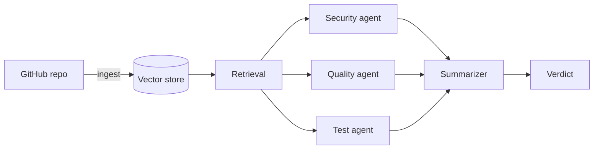

# pr-warden

[](https://github.com/Amowixcode/pr-warden/actions/workflows/ci.yml)

AI pull request review with context from the repository's history.

pr-warden indexes a repo's issues, commits and merged pull requests, then reviews a new PR with three agents running in parallel: security, code quality and test coverage. Their findings are merged into one verdict.

**[Try the web app](https://pr-warden.vercel.app)** · [API docs](https://pr-warden.onrender.com/docs)


## Why it's different

- Every finding must quote the diff it refers to. A string check confirms the quote exists and drops anything that doesn't. No second model grading the first.
- The final verdict comes from a fixed rule, not a model, so the same findings always give the same result.
- Past issues and PRs are retrieved as context, so a review can use what the project has already discussed.
- Once a PR has been reviewed, later runs only look at new commits. If nothing changed, no model is called.

## How it works



The agent graph and merge rules are documented in [agents/README.md](agents/README.md).

## Quick start

Requires Python 3.11, [uv](https://docs.astral.sh/uv/), a GitHub token and an OpenAI API key.

```bash
git clone https://github.com/Amowixcode/pr-warden.git
cd pr-warden
uv sync
cp .env.example .env   # add GITHUB_TOKEN and OPENAI_API_KEY

uv run warden doctor
uv run warden ingest facebook/react
uv run warden review facebook/react 36897
```

## CLI

| Command | |
|---|---|
| `warden ingest owner/repo` | Index a repository. Only fetches what's new since the last run. |
| `warden review owner/repo 123` | Review a pull request. |
| `warden doctor` | Check that tokens and storage are configured. |

| Flag | |
|---|---|
| `--full` | Ignore history and start over |
| `--verbose` | Show each agent's findings, not just the merged verdict |
| `--json` | Machine-readable output |

`warden review` exits with code 1 on REQUEST_CHANGES, so it can gate a CI step.

## Web app

A React frontend on Vercel and a FastAPI backend on Render, sharing the same review engine as the CLI. Reviews and ingestion run as background jobs, so you can leave the page and come back.

Deployment, environment variables and endpoint access are covered in [DEPLOY.md](DEPLOY.md). The web API needs Supabase for job tracking: run [supabase/schema.sql](supabase/schema.sql) and set `SUPABASE_URL` and `SUPABASE_KEY`.

## Stack

Python, LangGraph, LlamaIndex, ChromaDB, OpenAI, FastAPI, Supabase, React, TypeScript, Vite.

## Known limitations

- The frontend's API key ships in the JavaScript bundle, so it isn't a security boundary. `/review` is protected by a repo allowlist and a rate limit instead.
- The rate limit is held in memory and resets on restart.
- OpenAI budgets only send alerts. They don't stop requests, so spend is bounded by the allowlist and rate limit.
- The first request after the API has been idle is slow.
- All indexed repositories share one vector store.
- OpenAI is the only supported model provider.