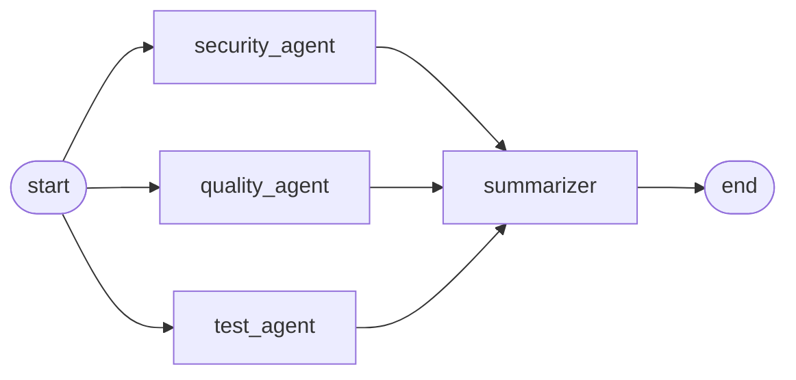

# agents

The review pipeline. Three specialist agents run in parallel, and a summarizer merges their results into one verdict.

## Nodes

**security_agent, quality_agent, test_agent** each read the PR (`state["pr"]`) and the retrieved context (`state["context"]`), call OpenAI with their own prompt, and return a partial update containing only their own key: `security_result`, `quality_result` or `test_result`.

**summarizer** runs once all three have finished. It merges their results into `final_verdict` using the rules below and makes no model call.

## Merge rules

- REQUEST_CHANGES if any agent requested changes and at least one issue survived evidence verification
- COMMENT if any agent commented, or if there are issues even though every agent approved
- APPROVE only when all three approved and there are no issues
- Issues and suggestions are interleaved across agents, then capped at 5 and 3, so one agent can't crowd out the others
- The summary is built from a template, not taken from any agent

The first rule exists because verification runs after an agent has picked its verdict. An agent can ask for changes and then have every finding dropped. Without the guard, that reaches the user as REQUEST_CHANGES with nothing to change.

## Why there's no reducer

Each agent writes to its own state key, so nothing is ever written to the same key concurrently and `ReviewState` needs no reducer.

If you replace the three keys with one shared list that every agent appends to, you must add one, for example `Annotated[list, operator.add]`. Without it, LangGraph raises `InvalidUpdateError` as soon as two agents finish in the same step.

## Wiring

`graph.py` adds one edge from start to each agent and a single `add_edge([...], "summarizer")` for the join. The list form waits for all three explicitly, which stays correct if one agent later gets a retry or a conditional edge.

`build_graph()` is kept separate from the module-level `graph` so tests can patch the node functions and then build a fresh graph. `.compile()` captures the functions at build time, so a patch applied afterwards has no effect. See `tests/unit/test_graph.py`.

`core/review_service.py` builds the initial state, runs the graph and maps `final_verdict` onto `ReviewResult`.